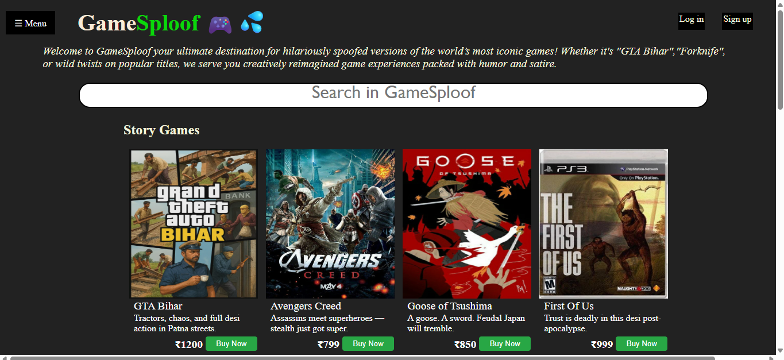
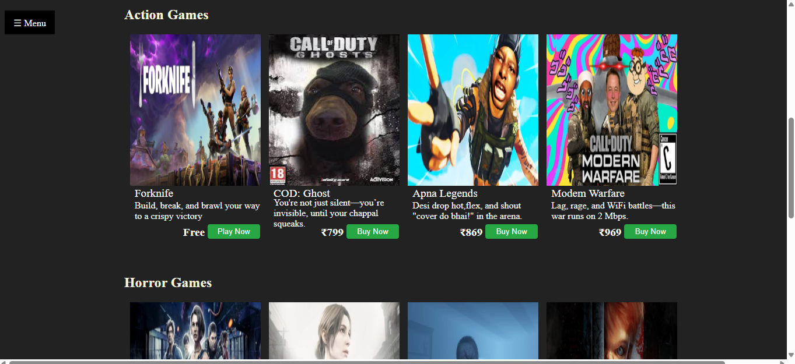
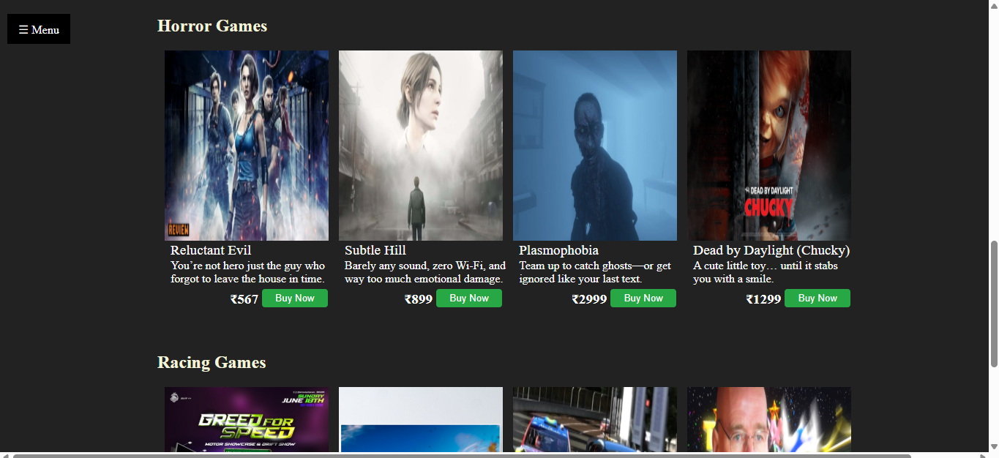

# 🎮 GameSploof

**GameSploof** is a creative front-end project that presents a fictional game store featuring parody versions of popular video games. It is designed using HTML and CSS, demonstrating skills in layout design, Flexbox, Grid, and interactive UI styling.

## 🌟 Features

- 🎮 Game cards with images and titles
- 💸 Discounted prices and a stylish "Buy Now" button
- 🧭 Fully responsive layout using CSS Flexbox and Grid
- 🌈 Hover effects, UI shine on images, and modern visual styling
- 📱 Mobile-first approach with clean structure

---

## 🛠️ Built With

- **HTML5**
- **CSS3** (Flexbox + Grid)

## 🎯 Key Features

- Structured layout using CSS Grid and Flexbox
- Game cards with titles, pricing (original & discounted), and action buttons
- Responsive design optimized for both desktop and mobile views
- Hover effects and subtle UI animations for a more dynamic feel
- Organized and scalable codebase

---

## 💡 Purpose & Learning Outcomes

This project was built to:

- Practice advanced CSS layout techniques (Grid + Flexbox combination)
- Create a modular and clean UI design
- Learn how to build scalable front-end components
- Explore creative naming and branding through spoofed game titles

---

## 📸 Screenshots

## 🔗 GitHub Profile
[Parth Kamath](https://github.com/ParthK604)

